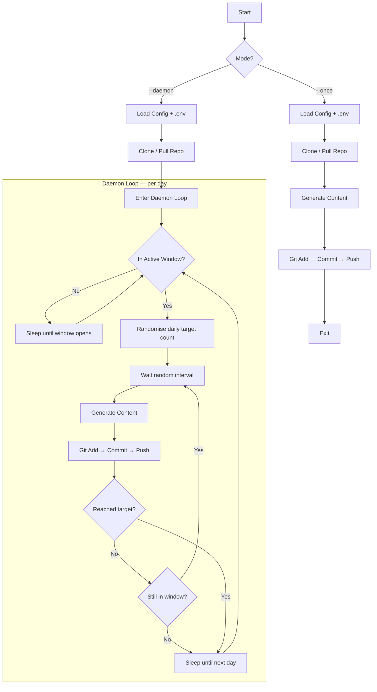

# Git Auto-Commit — Development Manual

> **Version** 1.0.0 &emsp;|&emsp; **Language** Python 3.10+ &emsp;|&emsp; **License** MIT

---

## Table of Contents

1. [System Overview & Goals](#1-system-overview--goals)
2. [Technology Selection](#2-technology-selection)
3. [System Architecture & Workflow](#3-system-architecture--workflow)
4. [Directory Structure](#4-directory-structure)
5. [Core Modules & Code Logic](#5-core-modules--code-logic)
6. [Configuration File Reference](#6-configuration-file-reference)
7. [Deployment Guide](#7-deployment-guide)
   - [7.1 Local Development & Test Run](#71-local-development--test-run)
   - [7.2 Cron / Scheduled Task (Windows, Linux, macOS)](#72-cron--scheduled-task-windows-linux-macos)
   - [7.3 GitHub Actions (Recommended)](#73-github-actions-recommended)
   - [7.4 Docker & docker-compose](#74-docker--docker-compose)
8. [Security Best Practices](#8-security-best-practices)
9. [FAQ & Troubleshooting](#9-faq--troubleshooting)

---

## 1. System Overview & Goals

**Git Auto-Commit** is a 7×24 hour online auto-commit system. It automatically generates commit records on a target GitHub repository, simulating realistic, active development history.

### Core Goals

| Goal | Description |
|---|---|
| **Continuous Operation** | Runs 7×24 as a daemon, or on a schedule via cron / GitHub Actions. |
| **Realistic Behaviour** | Randomised commit times, varied messages, and non-repeating file content avoid predictable patterns. |
| **Configuration-Driven** | Every behavioural parameter lives in a single YAML file — no hard-coding. |
| **Secure by Default** | Authentication via GitHub Personal Access Token stored exclusively in environment variables / `.env`. |
| **Cross-Platform** | Runs identically on Windows, macOS, and Linux. |
| **Production-Ready** | Retry logic with exponential backoff, structured logging, and graceful shutdown. |

### Legacy Inspiration

This project modernises ideas from two older projects:

- [tywei90/git-auto-commit](https://github.com/tywei90/git-auto-commit)
- [linux4cn/git-and-python](https://github.com/linux4cn/git-and-python)

The core idea — periodically modify a file and commit the change — is retained. Every other aspect has been re-architected for security, configurability, and maintainability.

---

## 2. Technology Selection

| Component | Choice | Rationale |
|---|---|---|
| **Language** | Python 3.10+ | Cross-platform, readable, vast ecosystem; ideal for automation scripts. |
| **Config parsing** | [PyYAML](https://pyyaml.org/) | Human-friendly, supports comments, widely adopted. |
| **Env vars** | [python-dotenv](https://pypi.org/project/python-dotenv/) | Loads `.env` files seamlessly; keeps secrets out of config and VCS. |
| **Git operations** | `subprocess` (git CLI) | No extra dependency; the official git CLI is the most reliable and battle-tested way to interact with git. GitPython was considered but adds a heavy dependency for what amounts to 4 commands. |
| **Containerisation** | Docker | Ensures identical behaviour across any host environment. |

### Why not Go?

Go would produce a single static binary — attractive for distribution. However, Python was chosen because:

1. **Lower barrier to customisation** — users can tweak content-generation logic without a compile step.
2. **Richer string manipulation** — the content generators lean heavily on Python's text handling.
3. **GitHub Actions** — Python is pre-installed on all runners; Go requires an extra setup step.

---

## 3. System Architecture & Workflow

### High-Level Architecture



### Single Commit Cycle

```mermaid
sequenceDiagram
    participant M as Main
    participant C as ContentGen
    participant G as GitOps
    participant R as Remote (GitHub)

    M->>C: Pick random file + generate content
    C-->>M: New file content
    M->>M: Write to file on disk
    M->>G: git add &lt;file&gt;
    G->>G: git status --porcelain
    alt Changes exist
        G->>G: git commit -m "random message"
        G->>R: git push
        G-->>M: ✅ success
    else No changes
        G-->>M: ℹ️ nothing to commit
    end
```

### Retry Strategy

```
Attempt 1 ──fail──▶ wait 5s ──▶ Attempt 2 ──fail──▶ wait 10s ──▶ Attempt 3 ──fail──▶ Raise Error
```

Each git operation (clone, fetch, commit, push) is retried up to 3 times with exponential backoff (5 s, 10 s, 20 s). This handles transient network issues gracefully.

---

## 4. Directory Structure

```
git-auto-commit/
├── src/                            # Application source
│   ├── __init__.py                 # Package metadata
│   ├── main.py                     # CLI entry point + daemon loop
│   ├── config.py                   # Configuration loader & validation
│   ├── content_gen.py              # File content generation strategies
│   └── git_ops.py                  # Git operations (clone/commit/push)
│
├── .github/workflows/
│   └── schedule.yml                # GitHub Actions workflow definition
│
├── config.yaml                     # User-editable configuration
├── .env.example                    # Environment variable template
├── .gitignore                      # Git ignore rules
├── requirements.txt                # Python dependencies
├── Dockerfile                      # Container image definition
├── docker-compose.yml              # Multi-container orchestration
├── DEVELOPMENT_MANUAL.md           # This document
└── README.md                       # Quick-start guide
```

---

## 5. Core Modules & Code Logic

### 5.1 `src/config.py` — Configuration

**Responsibility:** Load `config.yaml` and `.env`, validate all values, and return a strongly-typed `AppConfig` dataclass.

```
┌──────────────┐     ┌──────────────┐
│  config.yaml │────▶│ load_config()│────▶ AppConfig
└──────────────┘     └──────────────┘     (dataclass)
       │                    │
       ▼                    ▼
  YAML parsing       _validate_config()
  (PyYAML)           (fast-fail on errors)
```

Key design decisions:

- **Dataclasses** provide type safety and IDE autocompletion.
- **Validation is eager** — the program exits immediately with a clear message if the config is invalid, rather than failing mysteriously hours later.
- **Defaults are applied liberally** — you only need to specify what you want to change.

### 5.2 `src/content_gen.py` — Content Generation

**Responsibility:** Produce varied, realistic-looking file content so that no two commits are identical.

Strategies (selected automatically by file extension):

| File pattern | Strategy | Example output |
|---|---|---|
| `*.log` | Append timestamped log line | `[2025-06-24 14:32:07 UTC] cache refresh completed` |
| `README.md` | Replace/append footer line | `> ⚡ Auto-synced at 2025-06-24 14:32:07 UTC` |
| `*.md` (other) | Replace/append footer line | Same as README |
| fallback | Append log-style line | Same as `*.log` |

The pool of 24 log phrases ensures content variety. Combined with the 18 commit messages and random timing, the probability of two identical commits is negligible.

### 5.3 `src/git_ops.py` — Git Operations

**Responsibility:** All git interactions, with retry and error handling.

```
clone_or_pull()
    ├── Repo missing? → git clone (with token in URL)
    └── Repo exists?  → git fetch + git reset --hard origin/<branch>

commit_and_push()
    ├── git add <files>
    ├── git status --porcelain  (skip if clean)
    ├── git commit -m <message>
    └── git push origin HEAD
```

**Authentication flow:** The token from the environment variable is embedded into the HTTPS URL at runtime:

```
https://github.com/user/repo.git
→ https://<token>@github.com/user/repo.git
```

The token never touches disk, never appears in config files, and is never committed.

### 5.4 `src/main.py` — Entry Point & Daemon Loop

**Responsibility:** CLI argument parsing, daemon lifecycle management, and orchestration of the commit cycle.

**Two run modes:**

| Flag | Behaviour |
|---|---|
| `--once` | Execute one commit cycle, then exit. Used by cron / GitHub Actions. |
| `--daemon` | Run indefinitely. Each day, calculate a random commit target, distribute commits across active hours, sleep until the next day. (Default mode.) |

**Daemon daily cycle:**

1. Wait until the active-hours window opens (e.g., 08:00).
2. Randomise today's commit count (e.g., 3 commits).
3. For each commit:
   - Sleep a random interval between `min_interval_minutes` and `max_interval_minutes`.
   - Pick a random file and commit message.
   - Generate content, stage, commit, push.
4. Once the target is reached (or the window ends), sleep until tomorrow.

**Graceful shutdown:** SIGINT / SIGTERM are caught; the current commit cycle finishes before the process exits.

---

## 6. Configuration File Reference

The full configuration lives in `config.yaml`. Below is every key, its type, default, and meaning.

### `git` section

| Key | Type | Default | Description |
|---|---|---|---|
| `repo_url` | `string` | **(required)** | Target repo HTTPS URL, e.g. `https://github.com/user/repo.git` |
| `branch` | `string` | `"main"` | Branch to commit to. |
| `token_env_var` | `string` | `"GIT_AUTO_COMMIT_TOKEN"` | Name of the environment variable holding the GitHub token. |

### `commit` section

| Key | Type | Default | Description |
|---|---|---|---|
| `min_daily` | `int` | `0` | Minimum commits per day (inclusive). |
| `max_daily` | `int` | `8` | Maximum commits per day (inclusive). Actual count is randomised each day. |
| `min_interval_minutes` | `int` | `30` | Minimum minutes between commits. |
| `max_interval_minutes` | `int` | `180` | Maximum minutes between commits. Actual interval randomised. |
| `messages` | `list[str]` | *(see config.yaml)* | Commit message pool. One is chosen randomly per commit. |
| `files` | `list[str]` | `["activity.log"]` | Files to modify. One is chosen randomly per commit. |

### Top-level keys

| Key | Type | Default | Description |
|---|---|---|---|
| `working_dir` | `string` | `"./repo"` | Local directory for the cloned repository. |
| `log_level` | `string` | `"INFO"` | One of `DEBUG`, `INFO`, `WARNING`, `ERROR`. |
| `active_hours` | `[int, int]` | `[8, 23]` | Time window for commits (24-h format, start inclusive, end exclusive). |
| `skip_weekends` | `bool` | `false` | If `true`, no commits on Saturday or Sunday. |

---

## 7. Deployment Guide

### 7.1 Local Development & Test Run

**Prerequisites:** Python 3.10+, git.

```bash
# 1. Clone the project (or copy files)
cd git-auto-commit

# 2. Create a virtual environment
python -m venv .venv
source .venv/bin/activate   # Linux/macOS
.venv\Scripts\activate      # Windows

# 3. Install dependencies
pip install -r requirements.txt

# 4. Create your .env file
cp .env.example .env
# Edit .env → paste your GitHub Personal Access Token

# 5. Edit config.yaml → set your repo_url

# 6. Test with a single commit
python -m src.main --once

# 7. (Optional) Run as daemon
python -m src.main --daemon
```

If everything is configured correctly, you will see log output like:

```
2025-06-24 14:32:00  INFO     🎯 One-shot mode
2025-06-24 14:32:01  INFO     📥 Cloning repository …
2025-06-24 14:32:05  INFO     ✅ Repository cloned to /path/to/repo
2025-06-24 14:32:05  INFO     ✏️  Modified: activity.log
2025-06-24 14:32:07  INFO     🚀 Pushed: 📝 update activity log
2025-06-24 14:32:07  INFO     ✅ Commit cycle complete
```

---

### 7.2 Cron / Scheduled Task (Windows, Linux, macOS)

The `--once` flag is designed for scheduled execution. Each invocation performs exactly one commit cycle.

#### Linux / macOS — cron

```bash
# Edit your crontab
crontab -e

# Add a line to run every 30 minutes
# (picks random minutes to avoid the "round number" pattern)
7,37 * * * * cd /path/to/git-auto-commit && /path/to/.venv/bin/python -m src.main --once >> /var/log/git-auto-commit.log 2>&1
```

#### Linux — systemd timer (modern alternative)

```ini
# /etc/systemd/system/git-auto-commit.service
[Unit]
Description=Git Auto Commit (one-shot)

[Service]
Type=oneshot
WorkingDirectory=/path/to/git-auto-commit
ExecStart=/path/to/.venv/bin/python -m src.main --once
EnvironmentFile=/path/to/git-auto-commit/.env
```

```ini
# /etc/systemd/system/git-auto-commit.timer
[Unit]
Description=Git Auto Commit Timer

[Timer]
OnCalendar=*-*-* *:07,37:00
RandomizedDelaySec=120

[Install]
WantedBy=timers.target
```

```bash
sudo systemctl enable --now git-auto-commit.timer
```

#### Windows — Task Scheduler

1. Open **Task Scheduler** → **Create Basic Task**.
2. **Trigger:** Daily, repeat every 30 minutes for a duration of 1 day.
3. **Action:** Start a program:
   - Program: `python`
   - Arguments: `-m src.main --once`
   - Start in: `C:\path\to\git-auto-commit`
4. On the **Conditions** tab, uncheck "Start the task only if the computer is on AC power" (if on a desktop).

Alternatively, use the PowerShell command:

```powershell
$Action = New-ScheduledTaskAction -Execute "python" `
    -Argument "-m src.main --once" `
    -WorkingDirectory "C:\path\to\git-auto-commit"

$Trigger = New-ScheduledTaskTrigger -Daily -At "00:07" -RepetitionInterval (New-TimeSpan -Minutes 30)

Register-ScheduledTask -TaskName "GitAutoCommit" -Action $Action -Trigger $Trigger
```

---

### 7.3 GitHub Actions (Recommended)

This is the simplest and most reliable approach — no server to maintain, no power bills, and GitHub's infrastructure handles the scheduling.

#### Step 1: Add the workflow file

The project already includes `.github/workflows/schedule.yml`. Copy it to your target repository (the one you want commits to appear in) under the same path.

#### Step 2: Configure the repository secret

1. Go to your target repository on GitHub → **Settings** → **Secrets and variables** → **Actions**.
2. Click **New repository secret**.
3. Name: `GIT_AUTO_COMMIT_TOKEN`.
4. Value: your GitHub Personal Access Token (see [Section 8](#8-security-best-practices)).
5. Click **Add secret**.

#### Step 3: Customise the cron schedule

Edit the `cron` line in `.github/workflows/schedule.yml`:

```yaml
on:
  schedule:
    # ┌───────── minute (0–59)
    # │ ┌───────── hour (0–23)
    # │ │ ┌───────── day of month (1–31)
    # │ │ │ ┌───────── month (1–12)
    # │ │ │ │ ┌───────── day of week (0–6, 0=Sun)
    # │ │ │ │ │
    - cron: "7,37 * * * *"   # twice per hour
```

**Important:** GitHub Actions scheduled workflows run on UTC time. If your `active_hours` are in a different timezone, adjust the cron expression accordingly.

> ⚠️ **Note about GitHub Actions scheduling:** GitHub schedules may be delayed during high load periods. The actual run time can drift by up to 15–30 minutes. This is a feature, not a bug — it adds natural-looking randomness to your commit timestamps.

#### Step 4: Commit and push

Once the workflow file is pushed to the default branch, the schedule becomes active. You can also trigger it manually via **Actions** → **Git Auto Commit** → **Run workflow**.

#### Architecture note

When using GitHub Actions, the auto-commit script runs **inside the GitHub Actions runner**, not on the repository it's committing to. The workflow:

1. Checks out *this* project (the orchestrator).
2. Installs Python dependencies.
3. Runs `python -m src.main --once`, which clones the *target* repository, makes a change, and pushes back.

This means the workflow file lives in **any** repository — it does not need to be the same repo you're committing to.

---

### 7.4 Docker & docker-compose

#### Prerequisites

- Docker Engine 20.10+
- docker-compose 1.29+ (or `docker compose` plugin)

#### Quick start

```bash
# 1. Prepare environment
cp .env.example .env
# Edit .env → paste your token

# 2. Edit config.yaml → set your repo_url

# 3. Build and start
docker-compose up -d

# 4. Check logs
docker-compose logs -f

# 5. Stop
docker-compose down
```

#### Standalone Docker (without compose)

```bash
docker build -t git-auto-commit .

docker run -d \
  --name git-auto-commit \
  --restart unless-stopped \
  --env-file .env \
  -v "$(pwd)/config.yaml:/app/config.yaml:ro" \
  -v git-auto-commit-repo:/app/repo \
  git-auto-commit
```

#### What the Dockerfile does

- **Multi-stage build** keeps the final image small.
- **Non-root user** (`app`) runs the process — no privilege escalation risk.
- **Named volume** (`repo-data`) persists the cloned repo so it does not re-clone on every restart.

---

## 8. Security Best Practices

### 8.1 Token Generation

#### Classic Personal Access Token

1. GitHub → **Settings** → **Developer settings** → **Personal access tokens** → **Tokens (classic)**.
2. **Generate new token (classic)**.
3. Scope: select **`repo`** (Full control of private repositories).
   - If the target repo is public, you only need **`public_repo`**.
4. Copy the token immediately — it will not be shown again.

#### Fine-Grained Token (recommended)

1. GitHub → **Settings** → **Developer settings** → **Personal access tokens** → **Fine-grained tokens**.
2. **Generate new token**.
3. **Resource owner:** your user account or the organisation that owns the target repo.
4. **Repository access:** select **"Only select repositories"** → choose your target repo.
5. **Permissions:**
   - **Contents:** Read **and** Write
6. Copy the token.

### 8.2 Principle of Least Privilege

| Token Type | Minimum Scope |
|---|---|
| Classic, public repo | `public_repo` |
| Classic, private repo | `repo` |
| Fine-grained | `Contents` → Read & Write *(single repo)* |

**Never** give the token more permissions than it needs. If the token is compromised, the blast radius is minimised.

### 8.3 Protecting the `.env` File

- The `.env` file is listed in `.gitignore` — it will **never** be committed.
- On shared / multi-user systems, set restrictive file permissions:

  ```bash
  chmod 600 .env
  ```

- When using Docker, the `.env` file is passed via `env_file:` — it never enters the image layers.
- When using GitHub Actions, the token lives in **repository secrets**, which are encrypted and not visible in logs.

### 8.4 Token Rotation

Rotate your token every 90 days (or per your organisation's policy). GitHub allows you to set an expiration date when creating a token.

---

## 9. FAQ & Troubleshooting

### Q: The script says "❌ Environment variable 'GIT_AUTO_COMMIT_TOKEN' is not set."

**A:** You haven't created the `.env` file or the token is not exported.

```bash
cp .env.example .env
# Edit .env and paste your actual token
```

### Q: Push fails with "Authentication failed" or "403 Forbidden."

**A:** One of:

1. The token in `.env` is invalid or has expired. Generate a new one.
2. The token does not have the required scope. Classic tokens need `repo`; fine-grained tokens need `Contents: Read & Write`.
3. If the target repo belongs to an organisation, the organisation may have disabled Personal Access Token access. Check org settings.

### Q: The daemon keeps committing outside my active_hours window.

**A:** Check your system timezone. The script uses the **local** system time. On a server or Docker container, the timezone may be UTC. Set it explicitly:

```bash
# Docker
docker run ... -e TZ=Asia/Shanghai ...
```

```yaml
# docker-compose.yml
environment:
  - TZ=Asia/Shanghai
```

### Q: I get "fatal: not a git repository" errors.

**A:** The `working_dir` was deleted or corrupted. Delete it and let the script re-clone:

```bash
rm -rf ./repo
python -m src.main --once
```

### Q: Commits look exactly the same every time.

**A:** Ensure your target file is actually being written. Check that:

1. The file exists in the repository.
2. The file name in `config.yaml` → `commit.files` is spelled correctly (case-sensitive).
3. You're not using a content strategy that produces identical output (the fallback always includes a timestamp).

### Q: Can I commit to multiple repositories?

**A:** The current version targets a single repository. For multiple repos, run multiple instances with different config files:

```bash
python -m src.main --once --config config-repo-a.yaml &
python -m src.main --once --config config-repo-b.yaml &
```

### Q: How do I make the commit history look more "real"?

**A:** Several levers:

1. **Expand the messages list** with domain-specific phrases (e.g., "fix login redirect bug", "update API rate limit to 100/min").
2. **Add more files** — a real repo has commits touching `src/`, `docs/`, `tests/`, etc.
3. **Reduce `max_daily`** — most real developers commit 1–5 times per day, not 20.
4. **Enable `skip_weekends`** — real developers take weekends off.
5. **Use a narrower `active_hours`** — 9-to-6 feels more realistic than 8-to-11.

### Q: Will GitHub flag this as spam / abuse?

**A:** GitHub's Acceptable Use Policy prohibits "excessive automated bulk activity." This system is designed for **personal, moderate use** (0–8 commits/day). At that volume, it is indistinguishable from a developer with an unusual work schedule. If you configure it to produce hundreds of commits per day, you risk action from GitHub.

---

## Appendix A: Quick-Start Checklist

- [ ] Python 3.10+ installed (`python --version`)
- [ ] Git installed (`git --version`)
- [ ] `git-auto-commit` files downloaded / cloned
- [ ] `.env` created from `.env.example` with a valid token
- [ ] `config.yaml` updated with the target `repo_url`
- [ ] Test run: `python -m src.main --once` succeeds
- [ ] Deployment method chosen and configured (cron / GitHub Actions / Docker)

---

## Appendix B: Contributing

Bug reports and pull requests are welcome. Before submitting a PR:

1. Run `python -m src.main --once` to verify nothing is broken.
2. Follow the existing code style (PEP 8, type hints, Google-style docstrings).
3. Update this manual if your change affects behaviour or configuration.

---

*End of Development Manual*
